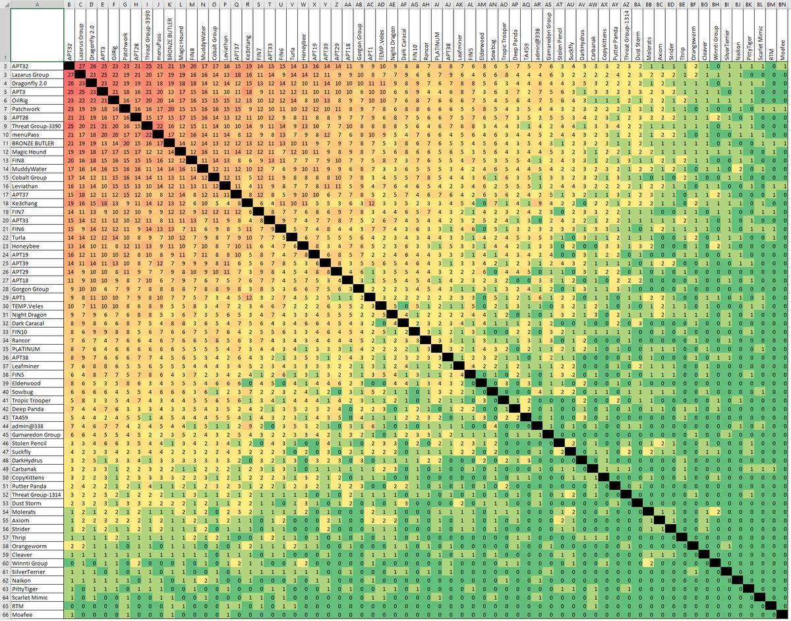
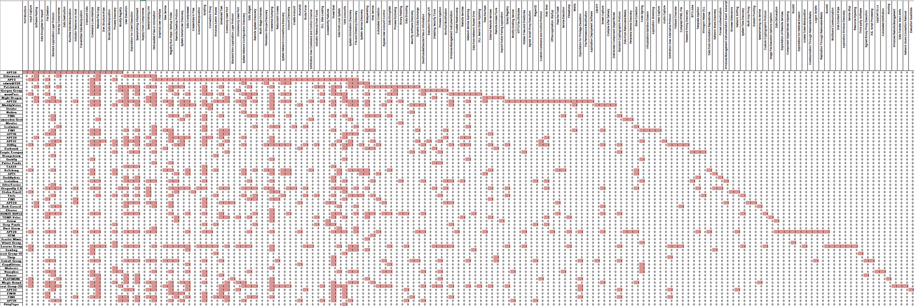
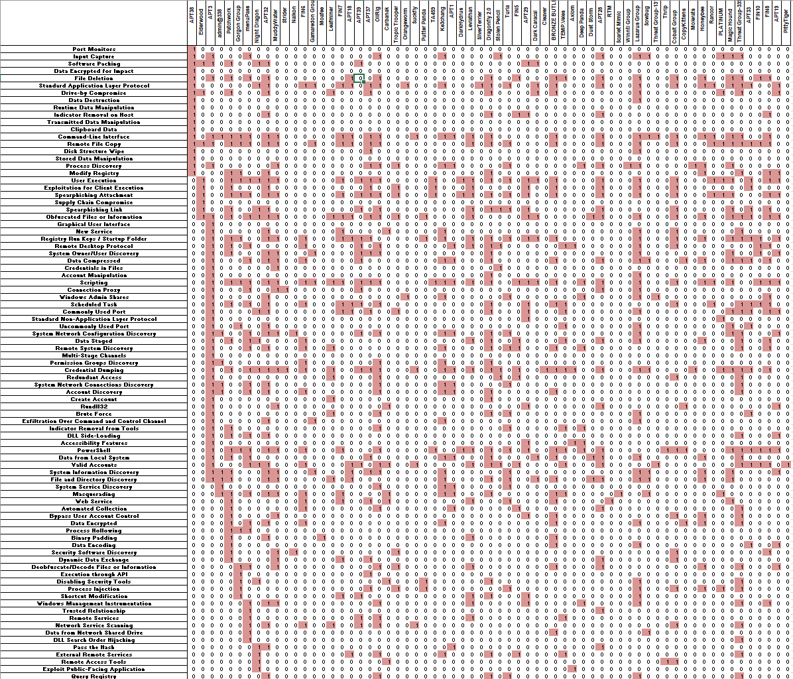
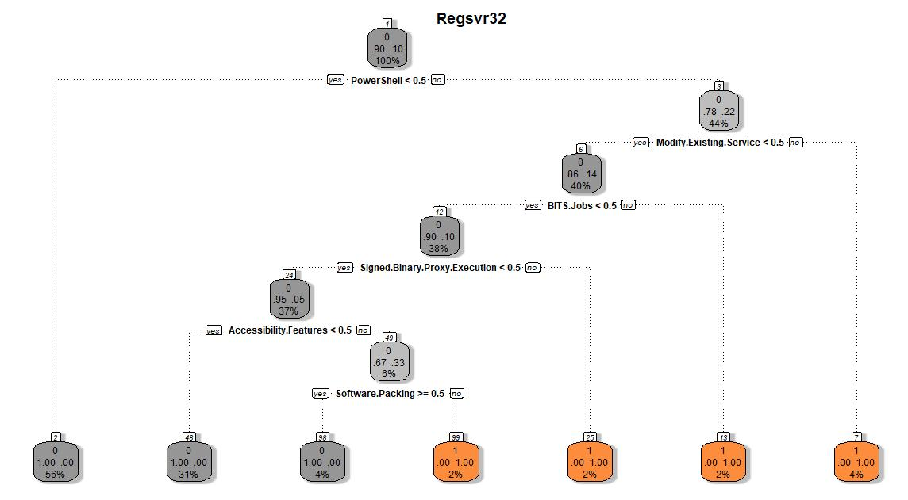

## Note

This repository and it's contributors are in no way affiliated with MITRE, or the Official ATT&CK team. We are community contributors who have come together and to start this analysis of the ATT&CK data. MITRE employees may also contribute but usually out of their own private time.

## Contributors

This project would not be possible without the active contributions and commitments from the following members of the community:

(@vysecurity)[https://twitter.com/vysecurity]
(@msgeekuk)[https://twitter.com/msgeekuk]

# ATT&CK Research and Analysis Repository

This repository contains the analysis performed around ATT&CK data. Vincent Yiu is not a data scientist; all of the conclusions should not be taken as facts and should be used only as a starting point for further research.

## Example screenshots of Analysis data

**Groups to common techniques count:** 

**Groups to Techniques:** 

**Techniques to Groups:** 

**What influences use of Regsvr32 technique?** 

## Example questions that we are trying to answer

Feel free to input and contribute as to how we might be able to answer any of the following questions. Feel free to start issues or pull requests.

**Courtesy of [@msgeekuk](https://twitter.com/msgeekuk)**

1) Are there previously unknown links between groups suggested by groups that share a larger proportion of techniques? Some higher % probably not but some might be.

2) Is the number of techniques used by each group a reasonable measure of how advanced that groups capability is generally thought to be?

3) Instead of 2 is there some other measure that more closely aligns with capability - for example the number of techniques only observed to be used by a single group, or groups using a larger number of rarer (techniques with lower numbers of groups using) techniques?

4) If some hierarchy of capability can be established, either directly from the data set or from external sources, is there evidence of certain groups avoiding (rather than simply not utilising) certain techniques?

5) Are there patterns of techniques shared by groups that have known Country attributions? Can these patterns be extended to groups with currently unknown attribution to suggest new attributions?

6) What about clustering of numbers of groups sharing each combination of pairs of techniques (Basically same format as my Group vs Group chart - but for techniques), does that provide any additional insight?